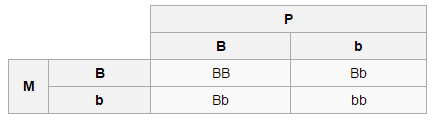

Principles of Tidy Data
========================================================
author: Karl Hailperin
date: 
autosize: true

What is Tidy Data?
========================================================

- Way to structure day for easier analysis
- Developed by His Royal Tidiness, Hadley Wickham
- Outlined in 2014 paper in Journal of Statistical Software
  - More informal version available as vignette for tidyr package (CRAN)
  
Tidy Data 
========================================================

1. Each variable forms a column.
2. Each observation forms a row.
3. Each type of observational unit forms a table.

1 Variable/Column
========================================================

- Example from my work: Membership Type = "75_SENIOR" or "86_FAMILY_STAFF"
- Really two variables: Location Code, Membership Type, Staff
- Should be three columns

1 Observation/Row
========================================================
incremental: true



(picture from Wikipedia)
***

```
  dad mom child
1   B   B    BB
2   b   B    Bb
3   B   b    Bb
4   b   b    bb
```

1 Unit/Table
========================================================

- Example: Clinic visits on one table, patient info on another
- If doing analysis using data from both, use join

Yeah, but So What?
========================================================

Benefits of tidy data:
- Easier to write functions that are interact properly 
- Easier to write code that works
- Easier to read code 

Readability
========================================================
incremental: true

- Hadley can write functions like this:

function(data.frame, variable_1, variable_2, ...)

- But really it works like this:

function(data.frame$variable_1, data.frame$variable_2, ...)

- Because he doesn't have to account for this:

function(data.frame[index of variable_1, ], data.frame$variable_2, ...)

- Which of these three parses best?

Some Tools for Tidying data
========================================================

CRAN:

- tidyr, stringr (general)
- jsonlite/tidyjson (JSON)
- broom (models)

In Development (for Excel):
- jailbreakr (https://github.com/rsheets/jailbreakr)
- tidyxl (https://github.com/nacnudus/tidyxl)
- unpivotr (https://github.com/nacnudus/unpivotr)

Gather Example
========================================================
incremental: true


```
  group_1 group_2 group_3
1  city_1  city_4  city_7
2  city_2  city_5  city_8
3  city_3  city_6  city_9
```
***

```r
library(tidyr)
tidy_cities <- gather(data = cities, key = category, value = city, group_1:group_3)
print(tidy_cities)
```

```
  category   city
1  group_1 city_1
2  group_1 city_2
3  group_1 city_3
4  group_2 city_4
5  group_2 city_5
6  group_2 city_6
7  group_3 city_7
8  group_3 city_8
9  group_3 city_9
```

Spread Example
========================================================
incremental: true

```
  dad mom child
1   B   B    BB
2   b   B    Bb
3   B   b    Bb
4   b   b    bb
```
***

```r
punnett_square <- spread(data = square, key = dad, value = child)
print(punnett_square)
```

```
  mom  b  B
1   b bb Bb
2   B Bb BB
```


```
  mom2 d_b d_B
1  m_b  bb  Bb
2  m_B  Bb  BB
```

Separate Example
========================================================
incremental: true

```
           Name
1 Rebecca Bunch
2     Josh Chan
3  Greg Serrano
4 Paula Proctor
```
***

```r
name_df <- separate(data = name_list, col = Name, into = c("First_Name", "Last_Name"), sep = " ")
print(name_df)
```

```
  First_Name Last_Name
1    Rebecca     Bunch
2       Josh      Chan
3       Greg   Serrano
4      Paula   Proctor
```

Unite Example
========================================================


```r
name_list <- unite(data = name_df, col = Name, First_Name, Last_Name, sep = " ")
print(name_list)
```

```
           Name
1 Rebecca Bunch
2     Josh Chan
3  Greg Serrano
4 Paula Proctor
```

Questions?
========================================================
